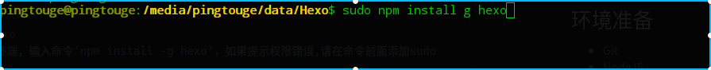
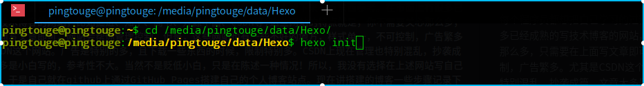
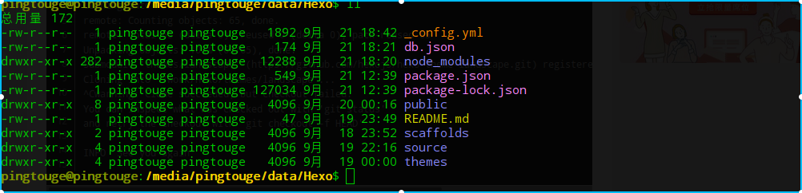
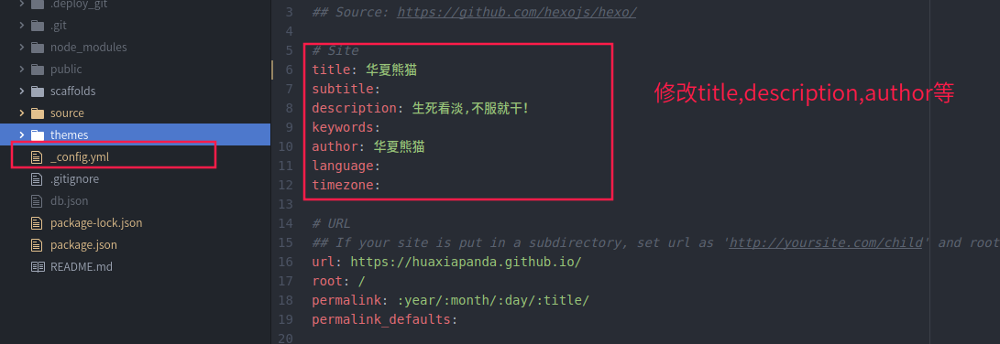
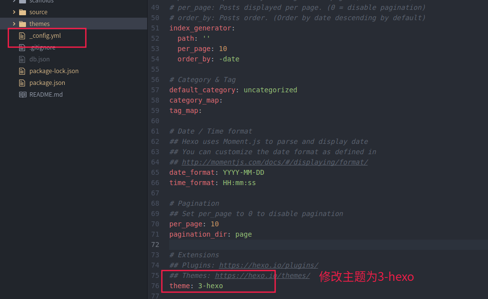
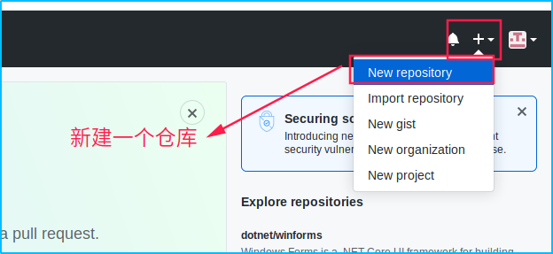
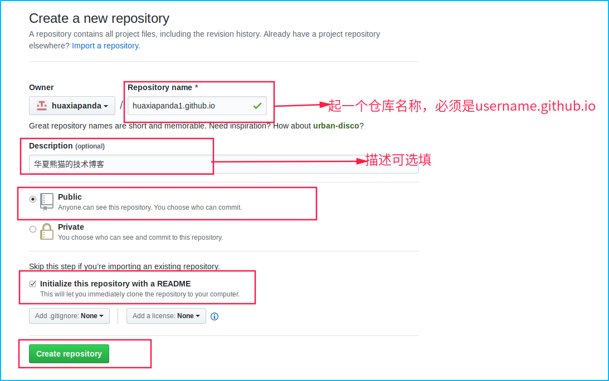
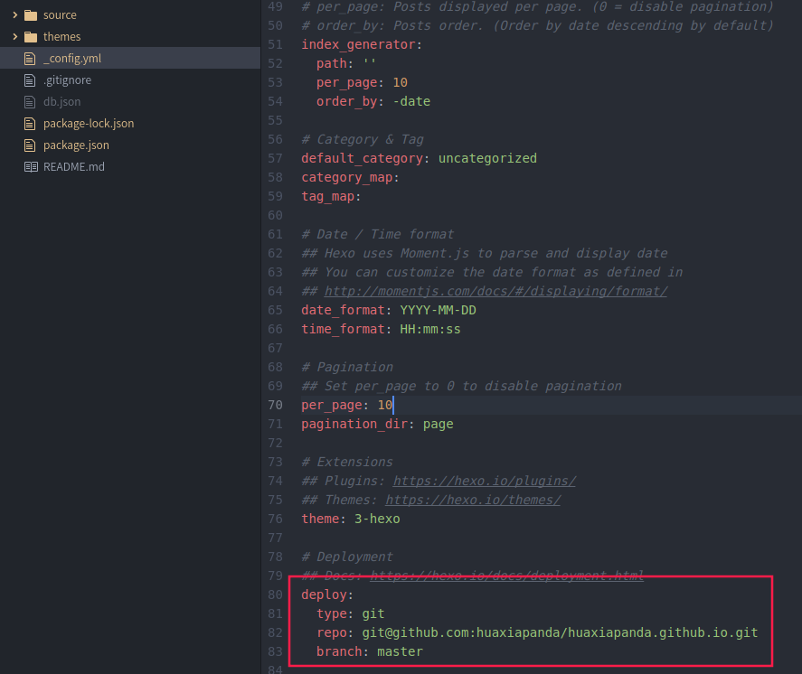
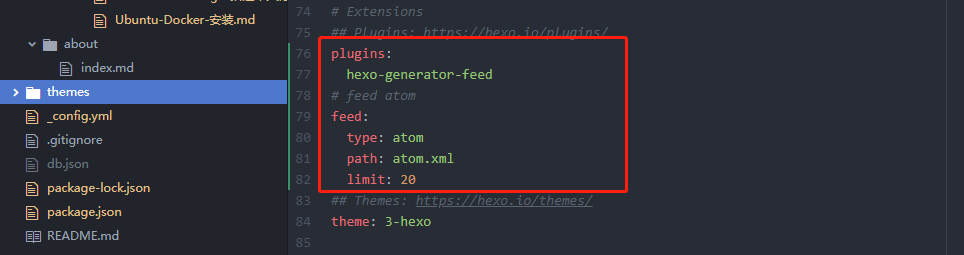
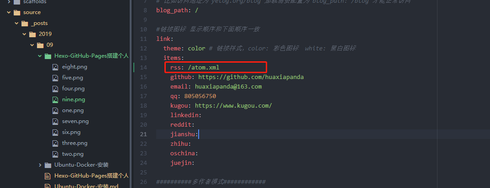

# 使用GitHub Pages + Hexo搭建个人博客站点
每个程序员都想把自己学习的过程和开发中遇到的问题记录下来，以便给后来人留下来一点东西参考。在市面上有很多已经成熟的写技术博客的网站，比如掘进、知乎、简书、开源中国、CSDN等,这些网站的特点就是，你不需要关心那么多，只需要在上面写文章即可，网站会帮你管理控制。但是，这些网站也有一些不好的地方，样式单一，不可控制，广告繁多。尤其是CSDN这个网站。广告是特别的多，且下载一些东西的时候，限制特别多。CSDN上现在管理也特别混乱，抄袭成篇，文章大多是小白写的，参考性不大。当然不是贬低小白，只是在陈述一种情况！所以，我没有选择在上述网站写自己的技术博客，于是自己就在github上通过GitHub Pages搭建自己的个人博客站点。现在讲搭建的博客一些步骤记录下来，希望能够对未来的你有所帮助，少趟一些坑。把更多的经历放在博客文章上面。也是自己博客的第一篇文章，如有不足，请多关照。
## 环境准备
  * Git
  * NodeJS

**这里默认搭建已经全部安装好了上述环境，不会的自行百度!对于程序员而言，这些不难的！其次我本身使用的深度国产操作系统(国产Linux),其他操作系统操作步骤一样！略有差别**

## 搭建步骤
### 安装Hexo
打开shell终端，输入命令‘npm install -g hexo’，如果提示权限错误,请在命令前面添加sudo,如图所示:

### 初始化hexo
在你的电脑创建一个文件夹用来进行初始化博客,我们在这里创建的文件夹是Hexo,然后切换至Hexo文件夹，执行hexo初始化命令hexo init.

初始化之后，hexo的目录结构如下所示

  * public: 这个是存放hexo编译md文件生成的html文件的一个目录。不用关注
  * node_modules: 这个是放一些模块代码的地方。不用关注。
  * scaffolds: 这个是存放一些模板md文件的地方。
  * source: 这是存放我们自己编写的博客文件的地方。主要关注这个地方。
  * themes: 这个地方是存放一些主题文件的地方，我们可以讲下载的主题放在这个文件夹下。

### 更换一个博客主题
hexo的默认的主题是landscape,不是很好看，大家可以根据自己的喜欢设置自己喜欢的博客主题，这里我使用的是[叶落阁](https://yelog.org/)的开源三段式主题。在shell窗口中输入命令：
```shell
git clone https://github.com/yelog/hexo-theme-3-hexo.git themes/3-hexo
```
克隆完成后，会在themes目录下看见3-hexo目录。接下来会使用3-hexo进行演示。
获取更多主题请访问hexo主题页面[hexo主题](https://hexo.io/themes/)
### 修改_config.yml对博客进行基础配置


修改之后进行保存。
**注意，冒号后面一定要有一个空格，否则编译报错**
### 预览本地博客
* 编译项目：hexo g
* 运行项目：hexo s

在浏览器输入：http://localhost:4000/就可以本地访问博客主页了
## 部署博客到GitHub Pages
### 创建GitHub账号
这个就不多说了，每一个程序员应该都有一个这样的账号，即使没有更新过任何代码。到[GitHub](https://github.com/)注册即可。
### 创建git仓库


仓库创建好之后，复制仓库的地址。
### 修改_config.yml

**注意，冒号后面一定要有一个空格，否则编译报错**
### 发布到GitHub Pages
首先安装自动部署工作，在shell窗口输入命令：
```shell
npm install hexo-deployer-git --save
```
然后输入命令发布博客:
```shell
hexo clean && hexo g && hexo d
```
最后在浏览器输入username.github.io即可访问博客。
关于3-hexo主图的使用请参照[3-hexo使用说明](https://yelog.org/2017/03/23/3-hexo-instruction/)
## 问题解决
### 关于md文件插入本地图片在GitHub Pages无法显示的问题说明
 由于hexo3版本后对很多插件支持有问题，hexo-asset-image插件在处理data.permalink链接时出现路径错误，把年月去掉了，导致最后生成的路径为%d/xxx/xxx需要对其做兼容处理。通过判断当前版本是否等于3的版本做不同的路径分割。因此，这里提供一个已经修复这个bug的插件
 ```shell
npm install https://github.com/7ym0n/hexo-asset-image --save
 ```
之后重新编译发布即可。然后刷新浏览器即可！
### 使用插件生产rss订阅信息
* hexo博客有一个专门生成RSS xml文件的插件hexo-generator-feed,我们只需要安装这个插件并配置即可。
```shell
npm install hexo-generator-feed
```
* 启用插件
在博客工程的根目录下的_config.xml文件中添加如下内容:
```xml
# Extensions
## Plugins: https://hexo.io/plugins/
plugins:
  hexo-generator-feed
# feed atom
feed:
  type: atom
  path: atom.xml
  limit: 20
```

之后需要修改themes/3-hexo目录下的_config.xml文件
```xml
link:
  theme: color # 链接样式，color: 彩色图标  white: 黑白图标
  items:
    rss: /atom.xml
    github: https://github.com/huaxiapanda
    email: huaxiapanda@163.com
    qq: 805056750
    kugou: https://www.kugou.com/
    linkedin:
    reddit:
    jianshu:
    zhihu:
    oschina:
    juejin:
```

重新发布,重新刷新浏览器即可.
