@[toc]
# 1. elasticsearch核心概念
[elk下载地址](https://www.elastic.co/cn/downloads/past-releases)
## 1.1 Near Realtime(NRT)
&emsp;&emsp;近实时，两个意思，从写入数据到数据可以被搜索到有一个小延迟（大概1秒）；基于es执行搜索和分析可以达到秒级.
## 1.2 Cluster
&emsp;&emsp;集群，包含多个节点，每个节点属于哪个集群是通过一个配置（集群名称，默认是elasticsearch）来决定的，对于中小型应用来说，刚开始一个集群就一个节点很正常.**可以在elasticsearch.yml中修改这个名称**
## 1.3 Node
&emsp;&emsp;节点，集群中的一个节点，节点也有一个名称（默认是随机分配的），节点名称很重要（在执行运维管理操作的时候），默认节点会去加入一个名称为"elasticsearch"的集群，如果直接启动一堆节点，那么它们会自动组成一个elasticsearch集群，当然一个节点也可以组成一个elasticsearch集群.
## 1.4 Document&field
&emsp;&emsp;文档，es中的最小数据单元，一个document可以是一条客户数据，一条商品分类数据，一条订单数据，通常用JSON数据结构表示，每个index下的type中，都可以去存储多个document。一个document里面有多个field，每个field就是一个数据字段。<br />
例如一个product document
```javascript
// product document
{
    "product_id":"3",
    "product_name":"华为荣耀P30 Pro",
    "product_desc":"50倍放大，清晰",
    "category_id":"2",
    "category_name":"手机数码"
}
```
**注：index其实就是一个数据库，可以存储很多type，type其实就是一张表,可以存储很多Document，Document其实就是一行数据,一行数据有很多Filed，Filed其实就是一行中的一个字段。**
## 1.5 Index
&emsp;&emsp;索引，包含一堆有相似结构的文档数据，比如可以有一个客户索引，商品分类索引，订单索引，索引有一个名称。一个index包含很多document，一个index就代表了一类类似的或者相同的document。比如说建立一个product index，商品索引，里面可能就存放了所有的商品数据，所有的商品document。
## 1.6 Type
&emsp;&emsp; 类型，每个索引里都可以有一个或多个type，type是index中的一个逻辑数据分类，一个type下的document，都有相同的field，比如博客系统，有一个索引，可以定义用户数据type，博客数据type，评论数据type。<br />
&emsp;&emsp;商品index，里面存放了所有的商品数据，商品document,但是商品分很多种类，每个种类的document的field可能不太一样，比如说电器商品，可能还包含一些诸如售后时间范围这样的特殊field；生鲜商品，还包含一些诸如生鲜保质期之类的特殊field <br>

example:<br />
&emsp;&emsp;type,日化商品type，电器商品type，生鲜商品type<br/>
&emsp;&emsp;日化商品type：product_id，product_name，product_desc，category_id，category_name<br/>
&emsp;&emsp;电器商品type：product_id，product_name，product_desc，category_id，category_name，service_period<br/>
&emsp;&emsp;生鲜商品type：product_id，product_name，product_desc，category_id，category_name，eat_period<br/>

&emsp;&emsp;每一个type里面，都会包含一堆document
```javascript
{
  "product_id": "2",
  "product_name": "长虹电视机",
  "product_desc": "4k高清",
  "category_id": "3",
  "category_name": "电器",
  "service_period": "1年"
}
{
  "product_id": "3",
  "product_name": "基围虾",
  "product_desc": "纯天然，冰岛产",
  "category_id": "4",
  "category_name": "生鲜",
  "eat_period": "7天"
}
```
## 1.7 shard
&emsp;&emsp;单台机器无法存储大量数据，es可以将一个索引中的数据切分为多个shard，分布在多台服务器上存储。有了shard就可以横向扩展，存储更多数据，让搜索和分析等操作分布到多台服务器上去执行，提升吞吐量和性能。每个shard都是一个lucene index。
## 1.8 replica
&emsp;&emsp;任何一个服务器随时可能故障或宕机，此时shard可能就会丢失，因此可以为每个shard创建多个replica副本。replica可以在shard故障时提供备用服务，保证数据不丢失，多个replica还可以提升搜索操作的吞吐量和性能。primary shard（建立索引时一次设置，不能修改，默认5个），replica shard（随时修改数量，默认1个），默认每个索引10个shard，5个primary shard，5个replica shard，最小的高可用配置，是2台服务器。
## 1.9 share和replica图解
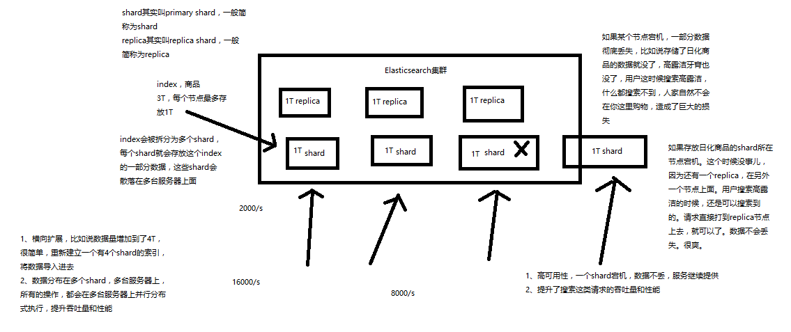
## 1.10 elasticsearch核心概念 vs 数据库核心概念
| Elasticsearch    | 数据库     |
| :-------------: | :-------------: |
| Document       | 行/row       |
| Type     | 表/table       |
| Index       | 库/database       |

# 2 基础API
## 2.1 Elasticsearch之document数据格式
&emsp;&emsp;elasticsearch是面向文档的搜索分析引擎<br/>
+ 应用系统的数据结构都是面向对象的，复杂的
+ 对象数据存储到数据库中，只能拆解开来，变为扁平的多张表，每次查询的时候还得还原回对象格式，相当麻烦
+ ES是面向文档的，文档中存储的数据结构，与面向对象的数据结构是一样的，基于这种文档数据结构，es可以提供复杂的索引，全文检索，分析聚合等功能.
+ es的document用json数据格式来表达<br/>

**传统的关系型数据库的数据格式:**
```Java
public class Employee {
  private String email;
  private String firstName;
  private String lastName;
  private EmployeeInfo info;
  private Date joinDate;
}

private class EmployeeInfo {
  private String bio; // 性格
  private Integer age;
  private String[] interests; // 兴趣爱好
}

EmployeeInfo info = new EmployeeInfo();
info.setBio("curious and modest");
info.setAge(30);
info.setInterests(new String[]{"bike", "climb"});

Employee employee = new Employee();
employee.setEmail("zhangsan@sina.com");
employee.setFirstName("san");
employee.setLastName("zhang");
employee.setInfo(info);
employee.setJoinDate(new Date());
// employee对象：里面包含了Employee类自己的属性，还有一个EmployeeInfo对象
// 两张表：employee表，employee_info表，将employee对象的数据重新拆开来，变成Employee数据和EmployeeInfo数据
// employee表：email，first_name，last_name，join_date，4个字段
// employee_info表：bio，age，interests，3个字段；此外还有一个外键字段，比如employee_id，关联着employee表
```
**elasticsearch数据格式为:**
```javascript
{
    "email":      "zhangsan@sina.com",
    "first_name": "san",
    "last_name": "zhang",
    "info": {
        "bio":         "curious and modest",
        "age":         30,
        "interests": [ "bike", "climb" ]
    },
    "join_date": "2017/01/01"
}
```
## 2.2 基础API
### 2.2.1 快速查看集群的健康状态
es提供了一套api,叫做cat api,可以查看es中各种各样的数据:
```bash
GET /_cat/health?v
```
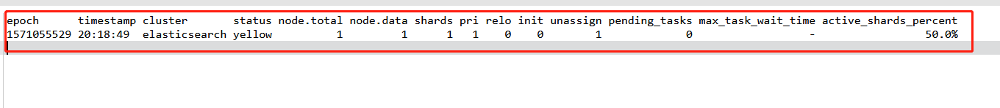
+ **如何快速了解集群的健康状态?green、yellow、red?**
  + green:每个索引的primary shard和replica shard都是active状态的。
  + yellow:每个索引的primary shard都是active状态的，但是部分replica shard不是active状态，处于不可用的状态。
  + red:不是所有索引的primary shard都是active状态的，部分索引有数据丢失了。
+ **为什么现在会处于一个yellow状态？<br/>**
&emsp;&emsp;我们现在就一个笔记本电脑，就启动了一个es进程，相当于就只有一个node。现在es中有一个index，就是kibana自己内置建立的index。由于默认的配置是给每个index分配5个primary shard和5个replica shard，而且primary shard和replica shard不能在同一台机器上（为了容错）。现在kibana自己建立的index是1个primary shard和1个replica shard。当前就一个node，所以只有1个primary shard被分配了和启动了，但是一个replica shard没有第二台机器去启动。
### 2.2.2 快速查看集群中有哪些索引
```bash
GET /_cat/indices?v
```
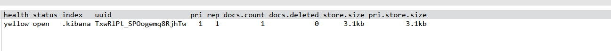
## 2.3 简单的索引操作
### 2.3.1 创建一个索引
```bash
# 创建一个新的索引
PUT /test_index?pretty
```
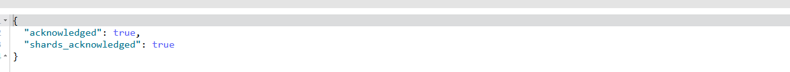
### 2.3.2 删除一个索引
```bash
# 删除一个索引
DELETE /test_index?pretty
```
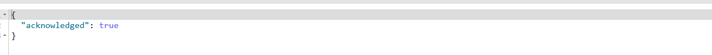
## 2.4 ES之增删改查(CRUD)操作API
&emsp;&emsp;es的增删改查操作使用商品的增删改查为例子
### 2.4.1 新增商品
语法:<br>
```bash
# 向es中插入一行记录
PUT /index/type/id
{
  "json数据"
}
```
案例:<br>
```bash
PUT /ecommerce/product/1
{
  "name":"gaolujie yagao",
  "desc":"gaoxiao meibai",
  "price":25,
  "producer":"gaolujie producer",
  "tags":["meibai","fangzhu"]
}
PUT /ecommerce/product/2
{
	"name":"jiajieshi yagao",
    "desc":"youxiao fangzhu",
    "price":25,
    "producer":"jiajieshi producer",
     "tags":["fangzhu"]
}
PUT /ecommerce/product/3
{
	"name":"zhonghua yagao",
    "desc":"caoben zhiwu",
    "price":40,
    "producer":"zhonghua producer",
     "tags":["qingxin"]
}
```
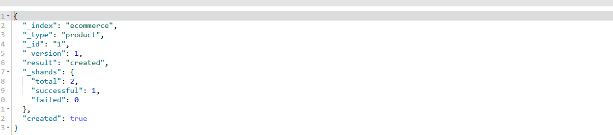<br />

+ index 插入es的库名称
+ type: 插入es的表名称
+ id: 插入es的行标识
+ version: 插入es的数据版本
+ result: 插入es的结果,created 代表新增
+ shards: 插入es的一些shards信息
  + total: 总共两个shard
  + successful: 成功1个,因为只启动了一个节点,目前只有一个primary shard,没有replica shard
  + failed: 失败0个
+ created: 新增结果,true代表成功,false代表失败<br />

### 2.4.2 查询商品文档
语法:<br>
```bash
//查询商品文档数据
GET /index/type/id
```
案例:<br>
```bash
GET /ecommerce/product/1
```
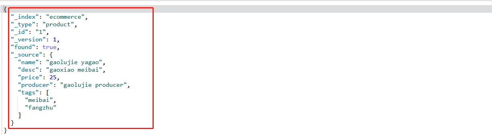<br>

+index: 查询es的库名称
+type: 查询es的表名称
+id: 查询es的行标识
+version: 查询es的数据版本
+ found: 是否查询到记录,true是查询到记录,false是没有查询到记录.
+source: 查询到的该条记录的内容<br/>

### 2.4.3 修改记录_替换文档
案例:<br>
```bash
PUT /ecommerce/product/1
{
    "name":"jiaqiangban gaolujie yaoga"
}
```
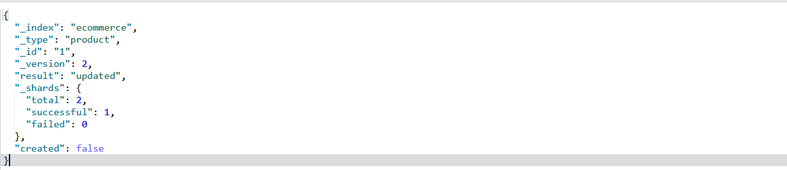<br/>

+ index: 查询es的库名称
+ type: 查询es的表名称
+ id: 查询es的行标识
+ version: 查询es的数据版本
+ result: 结果是更新<br>

**替换方式有一个不好，即使必须带上所有的field,才能去进行信息的修改**
```bash
GET /ecommerce/product/1
```
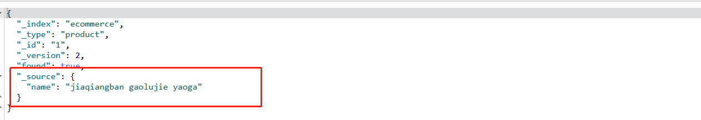
由上图可以看出,我们只修改了一个name字段,结果其他的字段都被覆盖掉了.但是这不是我们想要的结果.
### 2.4.4 修改记录_更新文档
案例:<br>
```bash
PUT /ecommerce/product/1
{
	"name":"gaolujie yagao",
    "desc":"gaoxiao meibai",
    "price":30,
    "producer":"gaolujie producer",
    "tags":["meibai","fangzhu"]
}
# 使用post进行文档的指定字段的更新
POST /ecommerce/product/1/_update
{
  "doc":{
    "name":"jiaqiangban gaolujie yagao"
  }
}
```
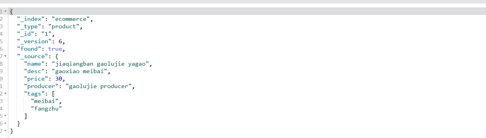
### 2.4.5 删除文档
```bash
# 删除文档
DELETE /ecommerce/product/1
```
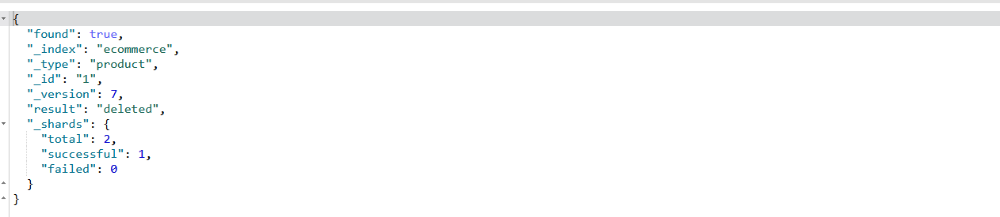
再次执行删除操作出现如下结果:
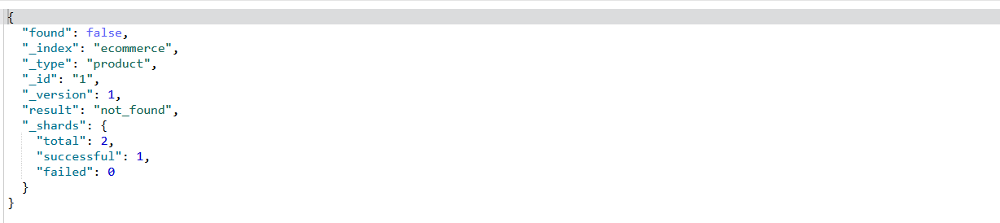
执行查询操作:
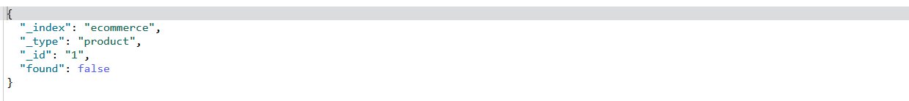
# 3 Elasticsearch查询方式
## 3.1 query string search
使用查询字符串进行搜索所有的商品信息
```bash
GET /ecommerce/product/_search
```
查询结果如下所示:
```javascript
{
  "took": 29,
  "timed_out": false,
  "_shards": {
    "total": 5,
    "successful": 5,
    "failed": 0
  },
  "hits": {
    "total": 3,
    "max_score": 1,
    "hits": [
      {
        "_index": "ecommerce",
        "_type": "product",
        "_id": "2",
        "_score": 1,
        "_source": {
          "name": "jiajieshi yagao",
          "desc": "youxiao fangzhu",
          "price": 25,
          "producer": "jiajieshi producer",
          "tags": [
            "fangzhu"
          ]
        }
      },
      {
        "_index": "ecommerce",
        "_type": "product",
        "_id": "1",
        "_score": 1,
        "_source": {
          "name": "gaolujie yagao",
          "desc": "gaoxiao meibai",
          "price": 30,
          "producer": "gaolujie producer",
          "tags": [
            "meibai",
            "fangzhu"
          ]
        }
      },
      {
        "_index": "ecommerce",
        "_type": "product",
        "_id": "3",
        "_score": 1,
        "_source": {
          "name": "zhonghua yagao",
          "desc": "caoben zhiwu",
          "price": 40,
          "producer": "zhonghua producer",
          "tags": [
            "qingxin"
          ]
        }
      }
    ]
  }
}
```
+ took: 查询花费的时间(ms)
+ timed_out: 是否超时 false表示没有,true表示超时
+ shards: 查询的shard信息
+ hits: 查询命中信息
  + total: 总共几条记录
  + max_score: 匹配分数
  + hits: 命中的所有记录
    + index: 库
    + type: 表
    + id: 行
    + score: 匹配分数
    + source: 信息<br/><br/>

## 3.2 Query DSL
**DSL:Domain Specified Language，特定领域的语言**<br>
http request body：请求体，可以用json的格式来构建查询语法，比较方便，可以构建各种复杂的语法，比query string search肯定强大多了.
### 3.2.1 查询所有的商品
```bash
GET /ecommerce/product/_search
{
  "query": {"match_all": {}}
}
```
### 3.2.2 按照指定条件查询
案例:查询商品名称中包含yagao的商品,并且按照商品价格降序排序
```bash
GET /ecommerce/product/_search
{
  "query": {
    "match": {
      "name": "yagao"
    }
  },
  "sort": [
    {
      "price": {
        "order": "desc"
      }
    }
  ]
}
```
### 3.2.3 分页查询
```bash
GET /ecommerce/product/_search
{
  "query": {"match_all": {}},
  "from": 0,
  "size": 2
}
```
### 3.2.4 查询指定字段信息
```bash
GET /ecommerce/product/_search
{
  "query": {"match_all": {}},
  "_source": ["name","price"]
}
```
### 3.2.5 高级查询
+ query filter<br>
案例:搜索商品名称包含yagao,而且售价大于25的商品
```bash
GET /ecommerce/product/_search
{
  "query": {
    "bool": {
      "must": {
        "match":{
          "name":"yagao"
        }
      },
      "filter": {
        "range": {
          "price": {
            "gt": 25
          }
        }
      }
    }
  }
}
```
+ full-text search<br>
全文检索
```bash
GET /ecommerce/product/_search
{
  "query": {"match": {
    "producer": "yagao producer"
  }}
}
```
+ phrase search<br>
短语搜索
```bash
GET /ecommerce/product/_search
{
  "query": {"match_phrase": {
    "producer": "yagao producer"
  }}
}
```
<br/>

**总结:跟全文检索相对应，相反，全文检索会将输入的搜索串拆解开来，去倒排索引里面去一一匹配，只要能匹配上任意一个拆解后的单词，就可以作为结果返回
phrase search，要求输入的搜索串，必须在指定的字段文本中，完全包含一模一样的，才可以算匹配，才能作为结果返回**
+ highlight search<br>
高亮搜索结果
```bash
GET /ecommerce/product/_search
{
  "query": {"match": {
    "producer": "producer"
  }},
  "highlight": {"fields": {"producer":{}}}
}
```
