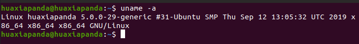
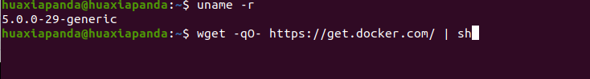
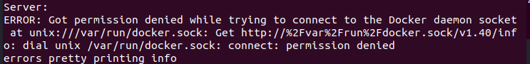
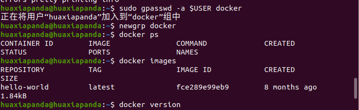
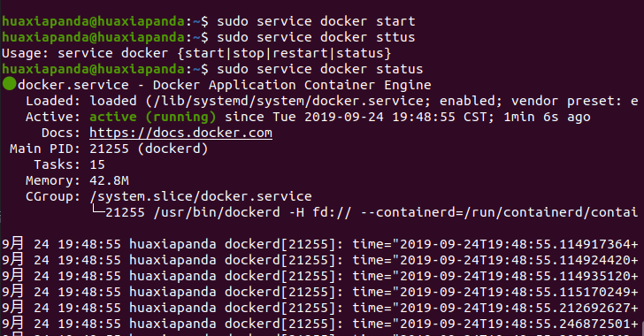
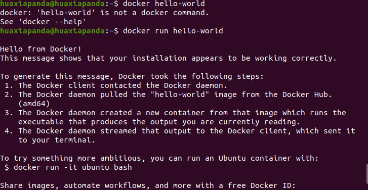

# 前提条件
Docker要求ubuntu系统的内核版本高于3.10，在进行浏览本页面时，请首先查看你的系统内核版本。如果不符合要求，请升级内核版本，或者更换其他安装方法。通过uname -a查看系统内核版本。
```shell
huaxiapanda@huaxiapanda:~$ uname -a
```

# 使用脚本安装Docker
## 获取最新版本的docker安装包
```shell
huaxiapanda@huaxiapanda:~$ wget -qO- https://get.docker.com/ | sh
```

安装完成后，会有一个提示：
```shell
If you would like to use Docker as a non-root user, you should now consider
    adding your user to the "docker" group with something like:

    sudo usermod -aG docker runoob
   Remember that you will have to log out and back in for this to take effect!  
```
当要以非root用户可以直接运行docker时，需要执行 sudo usermod -aG docker huaxiapanda 命令，然后重新登陆，否则会报没有权限的错误。会出现Docker daemon socket权限不足：

* 方案1 ：使用sudo获取root权限
* 方案2： 添加docker用户组，将当前用户加入docker用户组
```shell
huaxiapanda@huaxiapanda:~$ sudo groupadd docker #添加docker用户组
groupadd：“docker”组已存在
huaxiapanda@huaxiapanda:~$ sudo gpasswd -a $USER docker #将登陆用户加入到docker用户组中
正在将用户“huaxiapanda”加入到“docker”组中
huaxiapanda@huaxiapanda:~$ newgrp docker #更新用户组
huaxiapanda@huaxiapanda:~$ docker ps #测试当前用户是否可以正常使用docker命令
CONTAINER ID        IMAGE               COMMAND             CREATED             STATUS              PORTS               NAMES
huaxiapanda@huaxiapanda:~$
```

## 启动docker后台服务
```shell
# 启动docker服务
huaxiapanda@huaxiapanda:~$ sudo service docker start
# 查看docker服务状态
huaxiapanda@huaxiapanda:~$ sudo service docker status
```

## 测试运行hello-world
```shell
huaxiapanda@huaxiapanda:~$ docker run hello-world
```

至此，你就已经把docker在ubuntu系统安装好了！
